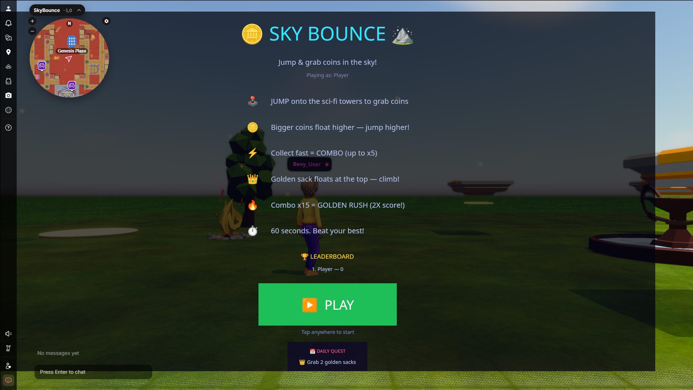
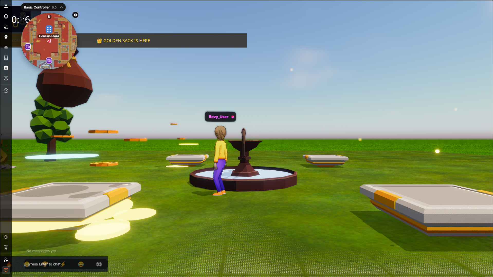

# 🪙 Sky Bounce ⛰️

**A competitive mobile-first coin-grabbing game for Decentraland**

Jump between floating sci-fi platforms, grab coins, build combos, and compete for the top of the global leaderboard — all optimized for mobile touch controls.

🔗 **Play now:** [anorlondo.dcl.eth](https://decentraland.org/jump?realm=anorlondo.dcl.eth) — live in the Decentraland Mobile App and web browser

---

## 🖼️ In-Game Screenshots

**Lobby** — onboarding, how-to-play, daily quest, and leaderboard preview:



**Gameplay** — golden sack event live, neon platforms, coin rings, and the HUD:



> 💡 **Judges:** the experience is live at [`anorlondo.dcl.eth`](https://decentraland.org/jump?realm=anorlondo.dcl.eth) — open it in the Decentraland Mobile App or a browser and tap to play. No video needed: the game is the demo.

---

## 🎮 How to Play

| Action | Desktop | Mobile |
|--------|---------|--------|
| **Move** | WASD / Arrow keys | Joystick (auto-move) |
| **Jump** | Space | Double-tap |
| **Start game** | Click | Tap screen |

### Game Rules
- ⏱️ **60 seconds** per round — collect as many coins as possible
- 🪙 **Low coins** = 10 pts (easy to reach)
- 🪙 **High coins** = 25 pts (need to climb towers)
- ⚡ **Combos** — collect coins quickly for up to **x5 multiplier**
- 👑 **Golden Sack** — appears every 12s, worth **100 pts**
- 🔥 **Golden Rush** — hit combo x15 to trigger **2X score** for 5 seconds!
- 🏆 **Leaderboard** — compete globally, beat the high scores

---

## ✨ Features

### Mobile-First Design
- Touch-optimized HUD with large, readable text
- Tap-to-start and double-tap-to-jump controls
- Responsive layout for all screen sizes
- Performance-optimized for mid-range devices

### Competitive Multiplayer
- **Server-authoritative scoring** powered by Decentraland's Multiplayer Server
- Scores validated server-side — no cheating
- Persistent rankings that survive server restarts
- Live cross-player score sync — coming in the next update

### Social Features
- **Emote bar** with 6 quick reactions: 🔥 Nice! / 😤 So close! / 🏆 gg / ⚡ Let's go! / 😂 Haha! / 👀 Watch this!
- Multiplayer message bus wired for cross-player chat and name registration
- Live avatar presence — see and play alongside other players in the arena

### Game Mechanics
- **Combo system** — fast collection = higher multiplier (up to x5)
- **Golden Rush** — combo x15 triggers arena-wide 2X score bonus
- **Moving platforms** — sci-fi towers rise and fall on timers
- **Daily quests** — rotating challenges for extra replayability
- **Persistent best score** — track your improvement over time

### Visual Polish
- Neon sci-fi aesthetic with particle effects
- Floating "+score" popups on collection
- Gold burst particles on coin/sack pickup
- Warm campfire ambient glow
- Floating ember dust across the sky

---

## 🏗️ Tech Stack

| Technology | Purpose |
|-----------|---------|
| **Decentraland SDK 7** | Scene engine, ECS architecture |
| **Multiplayer Server** | Shared leaderboard, player sync |
| **React ECS** | UI rendering (HUD, menus, emotes) |
| **Storage API** | Persistent leaderboard data |
| **Message Bus** | Real-time client-server communication |

---

## 📱 Mobile Optimization

- **Entity pooling** — particles and popups recycled, not created/destroyed
- **Reduced particle count** — 12 dust particles (down from 22) for smoother rendering
- **Coin pool** — fixed 12 coins + rush extras, automatically cleaned up
- **Emissive material limits** — balanced visual quality vs. performance
- **Efficient systems** — single game system tick, minimal per-frame allocations

---

## 🎯 Hackathon Criteria Alignment

| Criterion | How SkyBounce Delivers |
|-----------|----------------------|
| **Mobile-First** | Built for touch from the ground up, not adapted from desktop |
| **Social Value** | Server-side scoring, emote reactions, shared arena presence, competitive loop |
| **Mobile UX** | Large tap targets, readable text, intuitive controls |
| **Performance** | Entity pooling, optimized particles, tested for mid-range devices |
| **Creativity** | Golden Rush mechanic, combo multiplier, moving platform timing |
| **Retention** | Daily quests, persistent leaderboard, beat-your-best loop |
| **Execution** | Clean code, complete features, professional UI |

---

## 🚀 Getting Started

```bash
# Install dependencies
npm install

# Start local preview (includes multiplayer server)
npm start

# Build for production
npm run build

# Deploy to Decentraland
npm run deploy
```

---

## 📁 Project Structure

```
SkyBounce/
├── src/
│   ├── index.ts          # Entry point
│   ├── game.ts           # Core game logic, coin/sack mechanics, server sync
│   ├── state.ts          # Game state management, persistence
│   ├── config.ts         # All tunable parameters
│   ├── ui.tsx            # Mobile-first UI (HUD, menus, emotes, minimap)
│   ├── fx.ts             # Particle effects and popup text
│   ├── messages.ts       # Multiplayer server message schemas
│   └── server.ts         # Server-side leaderboard, validation, sync
├── assets/               # 3D models, textures, scene composition
├── sounds/               # Audio clips (coin, sack, end)
├── thumbnails/           # Scene thumbnails
└── scene.json            # Decentraland scene config
```

---

## 🏆 Leaderboard System

The leaderboard is powered by Decentraland's Multiplayer Server:

1. **Server-authoritative** — scores validated server-side, no cheating
2. **Persistent** — survives server restarts via Storage API
3. **Broadcast-ready** — server rebroadcasts chat events to every client
4. **Instant feedback** — local leaderboard UI updates the moment a round ends

---

## 🎵 Audio

| Sound | When |
|-------|------|
| `coin.wav` | Coin collected |
| `sack.wav` | Golden sack collected |
| `end.wav` | Round ends |

---

## 👤 Author

**Sithu Nyein**
📧 sithunyein.mailto@gmail.com

---

## 📄 License

MIT — Open source and free to use

---

*Built for the [Decentraland Friendzone Mobile Buildathon](https://dorahacks.io/hackathon/friendzone/detail)*
