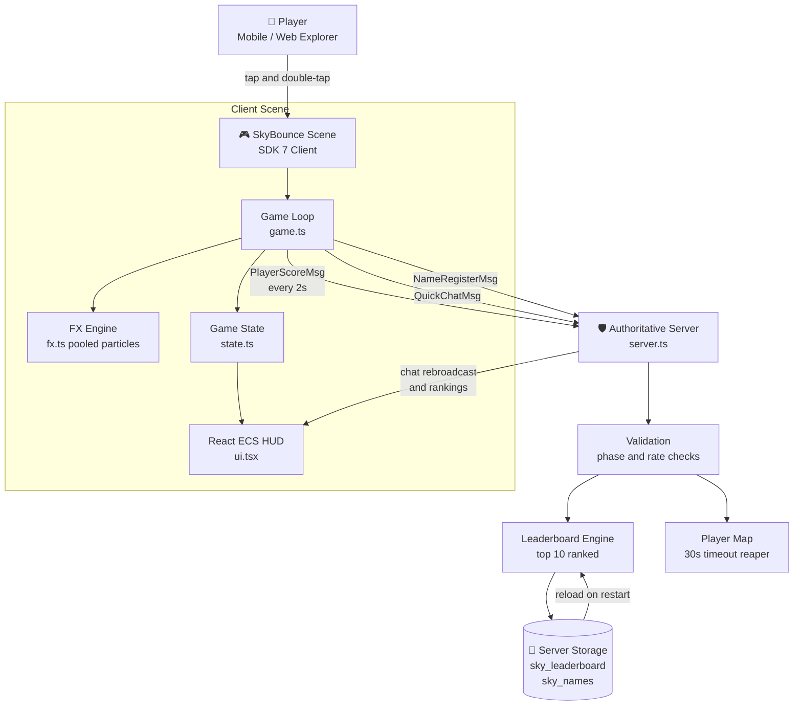

<div align="center">

# 🪙 SKY BOUNCE ⛰️

**A competitive mobile-first coin-grabbing game for Decentraland**


[**▶ PLAY NOW**](https://decentraland.org/jump?realm=anorlondo.dcl.eth) &nbsp;•&nbsp; [Report Bug](../../issues) &nbsp;•&nbsp; [Request Feature](../../issues)

</div>

---

## 📖 About

Jump between floating sci-fi platforms, grab coins, build combos and race up the global leaderboard. Rounds last 60 seconds, so every session is a quick burst of competition that fits into any moment on a phone.

**Live now at [anorlondo.dcl.eth](https://decentraland.org/jump?realm=anorlondo.dcl.eth)** in the Decentraland Mobile App or any browser.

## 🖼️ Screenshots

**Lobby** with onboarding, daily quest and leaderboard preview:


**Gameplay**, golden sack event live with the HUD running:


## 🎯 The Problem

Mobile players in social virtual worlds face three recurring failures:

1. **Desktop ports.** Most scenes are built for keyboard and mouse, then squeezed onto a phone. Controls feel wrong, text is tiny, and sessions drag.
2. **Empty worlds.** Single-player scenes give people no reason to stay, return or bring a friend. The world feels dead five minutes after spawn.
3. **No shared stakes.** Without a score that everyone can see and challenge, there is nothing to compete over and nothing to come back for.

SkyBounce is designed against all three: it is touch-first, its 60-second loop rewards "one more round", and every score lands on a server-held leaderboard that every player in the world competes on.

## ✨ Features

### Gameplay
- ⚡ **Combo system** with up to x5 multiplier for fast consecutive grabs
- 🔥 **Golden Rush** at combo x15: 2X score for 5 seconds plus a shower of bonus coins
- 👑 **Golden Sack** power-up worth 100 points, spawning every 12 seconds
- 🟡 **Risk tiers**: low coins are easy, high coins are worth 2.5X more
- 📅 **Daily quest** that rotates every 24 hours
- 🏆 **Persistent best score** and per-round stats (coins, sacks, max combo)

### Multiplayer and Social
- **Server-authoritative scoring** via Decentraland's Multiplayer Server
- **Live scoreboard broadcast**: every player's score syncs to all clients every 2 seconds
- **Persistent rankings** that survive server restarts through server Storage
- **Tappable emote bar** with 6 quick reactions: 🔥 Nice! / 😤 So close! / 🏆 gg / ⚡ Let's go! / 😂 Haha! / 👀 Watch this! Server rate-limits spam and rebroadcasts to everyone
- **Emote bubbles** pop above your avatar when you react
- **Players-online counter** on the lobby and HUD
- **Name registration** so your leaderboard entry carries your identity, with solo-graceful lobby that invites friends when you are the first one in

### Mobile-First Design
- Tap anywhere to start, double-tap to jump
- Large tap targets and high-contrast HUD text
- Pooled particles and capped entity counts for smooth mid-range phone performance

## 🎮 How to Play

| Action | Desktop | Mobile |
|--------|---------|--------|
| Move | WASD / Arrow keys | On-screen joystick |
| Jump | Space | Double-tap |
| Start / Restart | Click | Tap screen |
| Emote reaction | Click emote icon | Tap emote icon |

**Rules of the round:**

- ⏱️ 60 seconds per round
- 🪙 Low coins: 10 points. High coins: 25 points
- ⚡ Chain grabs within 3 seconds to build a combo, up to x5
- 👑 Golden sack: 100 points, despawns after 8 seconds
- 🔥 Combo x15 triggers Golden Rush: 2X score for 5 seconds
- 🏆 Highest score at the buzzer tops the leaderboard

## 🏗️ Architecture



The client never writes to Storage directly. Every score, name and chat message travels through the authoritative server, which validates it, ranks it and persists it.

## 📁 Project Structure

```
SkyBounce/
├── src/
│   ├── index.ts            # Entry point: boots scene, server and UI
│   ├── game.ts             # Core loop: coins, sack, combos, Golden Rush
│   ├── state.ts            # Central state and local persistence
│   ├── config.ts           # Every tunable value in one place
│   ├── ui.tsx              # React ECS HUD, lobby, emote bar, minimap
│   ├── fx.ts               # Pooled particle bursts and score popups
│   ├── messages.ts         # Strictly typed network message schemas
│   └── server.ts           # Authoritative server: leaderboard, chat, names
├── assets/
│   ├── asset-packs/        # GLB models: coins, sack, platforms, props
│   ├── images/             # Scene thumbnail
│   └── scene/              # Creator Hub scene composition
├── screenshots/            # In-game captures
├── sounds/
│   ├── coin.wav            # Coin collected
│   ├── sack.wav            # Golden sack collected
│   └── end.wav             # Round ends
├── scene.json              # Scene and world configuration
└── package.json
```

## 🧪 How to Test

**1. Run locally**

```bash
npm install
npm run start
```

This boots the scene plus the multiplayer server. Open the printed preview URL in a browser.

**2. Test multiplayer on one machine**

- Open the preview URL in a normal window
- Open it again in an incognito window (a second wallet or guest session)
- Play a round in both windows: both players appear on the server, chat and scores flow through the same room

**3. Test mobile UX without a phone**

- Open the preview in Chrome DevTools device mode (phone viewport and touch emulation)
- Or publish to your world and open the URL in the Decentraland Mobile App

**4. Build and deploy**

```bash
npm run build      # production bundle + typecheck
npm run deploy     # publish to your Decentraland World
```

## 🔒 Security

- **Server-authoritative state.** Leaderboard and names live in server Storage. Clients cannot read, write or forge persisted data directly.
- **Strict message schemas.** All network traffic is defined with typed `Schemas` declarations, so malformed messages fail fast.
- **Chat rate limiting.** Quick chat is capped at one message per 2 seconds per player, server side.
- **Presence timeouts.** Players who stop sending heartbeats are reaped from the live map after 30 seconds, so stale entries cannot linger.
- **No personal data.** The game stores only a wallet address, a self-chosen display name and game scores.

## ⚙️ Performance Notes

- Particle bursts and score popups are pooled and recycled, never allocated mid-game
- Fixed 12-coin pool with rush bonuses cleaned up on round restart
- 12 ambient dust particles (down from 22 in early builds)
- Single game system tick, minimal per-frame allocations

## 🛣️ Roadmap

- [x] Golden Rush event with bonus coin shower
- [x] Daily quest rotation
- [x] Server leaderboard and persistence
- [x] Server-broadcast live scoreboard on the HUD
- [x] Cross-player emote chat with on-screen bubbles
- [x] Players-online counter
- [ ] Weekly season resets with exclusive badge rewards

## 👤 Author

**Sithu Nyein**
📧 sithunyein.mailto@gmail.com

## 📄 License

[MIT](LICENSE) — open source and free to use.

---

*Built for the [Decentraland Friendzone Mobile Buildathon](https://dorahacks.io/hackathon/friendzone/detail).*
